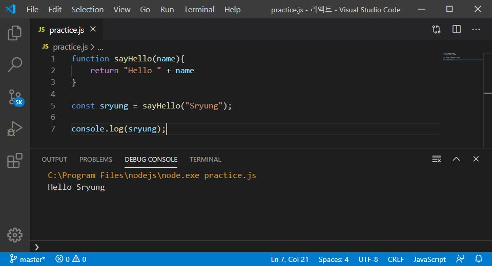

> 🎧 20.04.24 <br>
> 🧩 노마드코더 - 초보를 위한 React JS ([https://academy.nomadcoders.co/courses/enrolled/436641](https://academy.nomadcoders.co/courses/enrolled/436641))

# Ch 1. Fundamentals

<br>

react 수업을 시작하기 전 반드시 알아야 하는 것들을 알아보자.<br>
JS의 기초가 되는 부분을 이해하고 갈 것<br>

<br>

## <1> Arrow Functions


**Arrow Function (화살표 함수>**<br>
```javascript
function sayHello(name){
	return "Hello " + name
}

const sryung = sayHello("Sryung");

console.log(sryung);
```
<br>
sayHello라는 함수는 name을 파라미터로 받고 "Hello "와 name을 합쳐서 반환함<br>
그 결과 콘솔창에는 *Hello Sryung*이 띄워짐<br>
<br>
<br>
```javascript
function sayHello(name){
	"Hello " + name
}
```
만약 sayHello 함수가 아무것도 return하지 않는다면 (return을 지운다면)<br>
*Hello Sryung*이 아닌 *undefined*가 띄워짐<br>
<br>
대신에<br>
```javascript
const sayHello = (name) => "Hello " + name;
```
기본적으로 화살표함수는 return이 함축되어 있기 때문에 function을 대신해 위와 같이 표기해도 원하는 결과가 출력됨<br>
<br>
<br>
```javascript
function sayHello(name = "Sryung"){
	return "Hello " + name
}

const sryung = sayHello();

console.log(sryung);
```
그리고 "Sryung"을 function에 넣어 default 값으로 설정할 수도 있음<br>
```javascript
const sayHello = (name = "Sryung") => "Hello " + name;
```
이 경우에도 역시 화살표 함수로 표기할 수 있음<br>
<br>
<br>
아래는 다른 예시로,  버튼을 누르면 event를 console.log 하는 코드로 모두 같음<br>
```javascript
const button = document.querySelector("button");

const handleClick = event => console.log(event);

button.addEventListener("click", handleClick);
```
```javascript
const button = document.querySelector("button");

button.addEventListener("click", event => console.log(event));
```
```javascript
const button = document.querySelector("button");

button.addEventListener("click", function(event) {
	console.log(event);
});
```
<br>
<br>
<br>

**화살표 함수의 유일한 규칙**
> argument가 하나일 때는 괄호가 필요 없다

```javascript
button.addEventListener("click", {event, something} => console.log(event));
```
argument가 두 개(event와 something)일 경우, 위와 같이 표기<br>

<br><br><br>

## <2> Template Literals

**Template Literals** <br>
Template, Variable, String들 다루기 가장 좋은 방법<br>

```javascript
const sayHello = (name = "Sryung") => "Hello " + name;
```
```javascript
const sayHello = (name = "Sryung") => `Hello ${name}`;
```
``(backticks) 를 이용해 텍스트 전체를 감싸고<br>
+연산을 이용해 끊어 표현하지 않고, 문장 내에 바꿀 부분만 골라냄<br>
  
<br><br><br>

## <3> Object Destructuring

## <4> Spread Operator

## <5> Classes

## <6> Array.map

## <7> Array.filter

## <8> .forEach .includes .push
